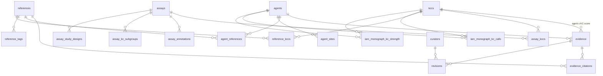

# hKCC database (`hkcc.db`) — table reference

Schema is defined in `hkcc/db/models.py`. The application reads data through `hkcc/app/data_client.py` (HTTP API or direct SQLAlchemy). The API exposes subsets via `hkcc/api/routers/*` and `hkcc/api/schemas.py`.

| Field | Value |
|-------|-------|
| **Version** | see [`pyproject.toml`](../pyproject.toml) |
| **Developed by** | Data Analysis Team @KaziLab.se |
| **Contact** | hkcc@kazilab.se |

---

## Entity relationship (overview)

**Hub tables:** `kccs`, `agents`, `references`, `assays`  
**Junction / detail tables:** everything else links these four.

---

## 1. Framework

### `kccs` (10 rows)

**Purpose:** The ten established Key Characteristics of carcinogens — the reference ontology (Layer 1). Defines the columns of the evidence matrix. The four formerly "extended" entries became candidate domains; see `candidate_domains`.

**Key columns:** `id` (e.g. `kcc-01`), `n`, `title`, `short`, `description`, `mechanism`, `icon`, `is_extended`.

**Relationships:** Referenced by `evidence`, `assay_kccs`, `assay_annotations`, `reference_kccs`, IARC monograph tables.

**Source:** the published KCC framework (Smith et al. 2016) plus the four extended characteristics. Stored directly in `hkcc.db`; not derived from KCAD.

**Code usage:**

- API: `GET /api/v1/kccs`, `GET /api/v1/kccs/{id}` (`hkcc/api/routers/kccs.py`)
- App: Overview, Browse KCCs, KCC Detail, Evidence Matrix (`list_kccs()` in `hkcc/app/data_client.py`)
- Export: `hkcc/pipelines/export_release.py`

### `candidate_domains` (5 rows)

**Purpose:** Layer 2 of the annotation model — cross-cutting mechanistic domains that qualify how an observation arose. **Not** key characteristics: they carry no score, and `evidence` has no foreign key to them.

**Key columns:** `id`, `code` (EMD1–EMD4, CD5), `title`, `definition`, `minimum_evidence`, `key_exclusions`, `status` (`candidate`), `source_ref_id`.

**Source:** EMD1–EMD4 from Kazi et al. (`kazi2026-emd`); CD5 is platform-only and cites its own GJIC literature.

**Code usage:** `GET /api/v1/domains`, `list_candidate_domains()` in `hkcc/app/data_client.py`, the Layer-2 section of the Browse KCCs page.

### `candidate_domain_kccs` (22 rows)

**Purpose:** Parent links from a domain to the KCCs it touches. A domain with no parent would be a fourteenth characteristic by stealth, so the test suite forbids it.

`relation` takes four values, because `primary`/`secondary` was carrying four meanings at once and could express neither direction nor opposing polarity:

| value | meaning |
|---|---|
| `home` | The KCC an observation files under, in essentially every instance of the domain. The only relation that means "the domain belongs here"; the test suite requires each domain to have at least one. |
| `downstream` | A KCC endpoint the domain can produce. Case-dependent. |
| `upstream` | A KCC that induces or enables the domain — the same pair of nodes with the arrow reversed. |
| `contrastive` | A KCC of opposing polarity: evidentially adjacent, informative, and **never a positive**. Reserved for EMD4–KCC9, where the domain measures induction of senescence and the characteristic is defined as bypass of it. |

The API exposes these as `home_kcc_ids` / `downstream_kcc_ids` / `upstream_kcc_ids` / `contrastive_kcc_ids`. The older `primary_kcc_ids` / `secondary_kcc_ids` fields are kept for compatibility and collapse to `home` and not-`home` respectively, discarding direction.

### `candidate_domain_assays` · `candidate_domain_references`

**Purpose:** Assays that can measure a domain (with an `evidence_level` of `descriptive` or `functional`) and its anchor literature. Both were migrated from the former `assay_kccs` / `reference_kccs` rows of the extended KCCs.

---

## 2. Carcinogenic agents

### `agents` (~171 rows)

**Purpose:** Carcinogen profiles (name, CAS, IARC group, summary, monograph metadata).

**Key columns:** `id`, `name`, `cas`, `iarc_group`, `agent_type`, `summary`, `monograph_volume`, `evaluation_year`, `source_ref_id` → `references.id` (provenance anchor, usually KCAD paper).

**Relationships:** Parent of `evidence`, `agent_sites`, `agent_references`; FK target for `assay_annotations.agent_id`, IARC tables.

**Loaded by:**

- KCAD agent roster (Rigutto et al. 2025)
- IARC agent metadata from KCAD Supplementary Table 1 (CAS, group, monograph volume, evaluation year)
- IARC 10-year retrospective agents (Rusyn et al. 2024)

**`agent_type` vocabulary.** A controlled list, enforced by
`tests/test_agent_types.py` (`ALLOWED_TYPES`), which is the single source of
truth — `tests/test_docs_vocabulary.py` fails if this paragraph drifts from it.

Original set: `Industrial chemical`, `Industrial solvent`,
`Industrial impurity`, `Pesticide`, `Persistent organic pollutant`,
`Brominated flame retardant`, `Nanomaterial`, `Occupational exposure`,
`Dietary factor`, `Personal habit`.

Added with the Volume 100 import, which is mostly not chemicals:
`Pharmaceutical`, `Biological agent`, `Radiation`, `Metal or metalloid`,
`Mineral fibre or dust`, `Occupational dust`.

The IARC import originally defaulted every
row it created to `Industrial chemical`, which filed night shift work, welding,
coffee, mate, processed meat and opium consumption as industrial chemicals, and
left two Volume 112 pesticides (glyphosate, tetrachlorvinphos) alongside them.
Those nine rows are corrected; new agents must be typed explicitly rather than
defaulted.

**Volume 100 import.** 84 agents from the IARC Monograph Volume 100 Group 1 re-review
(Krewski et al. 2019, Sci. Pub. 165 Ch. 22, Fig. 22.4) were added alongside the Volume
112–130 set. Benzene and MOCA already existed and were not duplicated. Evidence rows from
this source carry the `[vol100-kc]` prefix in `curator_notes` and are anchored to
`krewski2019-iarcsp165-ch22`; cells the figure leaves white ("No Source") produce **no row**,
so they read as *not assessed*. See [KCC_EVIDENCE_RULES.md](KCC_EVIDENCE_RULES.md).

**Source reconciliation:** the KCAD and IARC imports each contributed agent rows, and four
substances arrived twice under different ids. They have been merged onto the row carrying the
correct spelling and CAS number, keeping both sides' data:

| Surviving id | Merged away | Why |
|--------------|-------------|-----|
| `2mbt` | `2-metcaptobenzothiazole` | same substance, Monograph Vol 115; the second name is a source typo |
| `tbbpa` | `tetrabrobobisphenol-a` | same substance, Vol 115; source typo |
| `tcab` | `3-3-4-4-tetrachloroazobenzene` | same substance, Vol 117; the two rows disagreed on IARC group (2B vs 2A) and the Rusyn 2024 value (**2A**) was adopted |
| `styrene-7-8-oxide` | `styrene-oxide` | identical CAS 96-09-3 |

Two agent rows with no evidence, literature or annotations attached were dropped
(`cobalt-metal-without-tungsten-carbide-or-other-metal-alloys`, `dieldrin-and-aldrin-metabolized-to-dieldrin`).

Parent compounds, their salts and IARC's combined entries (e.g. `aniline`, `aniline-hcl` and
`aniline-and-aniline-hydrochloride`) are **not** duplicates and remain separate rows.
`tests/test_agent_integrity.py` enforces that no two agents share a CAS or a normalized name.

**Code usage:**

- API: `GET /api/v1/agents`, `GET /api/v1/agents/{id}` (`hkcc/api/routers/agents.py`)
- App: Carcinogens list, Agent Detail, Overview (`list_agents`, `get_agent`)
- Monograph API joins `agents` for names

### `agent_sites` (0 rows in the shipped release)

**Purpose:** Cancer sites associated with an agent (e.g. lung, liver).

**Key columns:** `(agent_id, site)` composite PK.

**Source:** IARC monograph tumour-site listings. **Not populated** in the shipped dataset (0 rows).

**Code usage:** Included in agent API/UI when populated (`Agent.sites` in `hkcc/api/routers/agents.py`).

---

## 3. Evidence matrix (derived from published source tables)

### `evidence` (~844 rows)

**Purpose:** Curator-assigned **0–4 evidence scores** for each `(agent_id, kcc_id)` pair. Powers the main evidence heat-map.

**Key columns:** `agent_id`, `kcc_id`, `score` (0–4), `direction` (`positive` / `protective` / `equivocal` / `negative` / `unspecified`), `n_refs`, `source_track` (`10yr-iarc` / `vol100-kc`), `source_count` (raw count the score derives from; denominator differs by track; null for label-derived scores), `n_refs`, `curator_notes`, `last_updated`. Unique on `(agent_id, kcc_id)`. A `protective` row always has score 0 — enforced by `ck_protective_not_positive`.

**Relationships:** FK → `agents`, `kccs`; child `evidence_citations`, `revisions`.

**Source:** Rusyn et al. 2024, aggregated from the IARC 10-year calls and strength labels (see [KCC_EVIDENCE_RULES.md](KCC_EVIDENCE_RULES.md)). KCAD contributes no rows to this table.

**Code usage:**

- API: `GET /api/v1/matrix` builds scores from `evidence` (`hkcc/api/routers/matrix.py`)
- API: agent detail embeds evidence cells (`hkcc/api/routers/agents.py`)
- App: Evidence Matrix, Overview fingerprint, KCC Detail (`get_matrix`, `agents_with_evidence`)
- Contribute: `POST /api/v1/contribute` targets existing `evidence` rows (`hkcc/api/routers/contribute.py`)

### `evidence_citations` (~1,607 rows)

**Purpose:** Links each evidence cell to supporting `references` rows.

**Key columns:** `(evidence_id, reference_id)` composite PK.

**Source:** Rusyn et al. 2024 for the score anchor; KCAD annotations contribute additional citations to existing cells without changing scores.

**Code usage:**

- Agent detail returns `reference_ids` per evidence cell (`hkcc/api/routers/agents.py`)
- App: `evidence_for_agent()` resolves citation cards (`hkcc/app/data_client.py`)

### `revisions` (often empty)

**Purpose:** Pending community proposals to change an evidence score (v2 curation workflow).

**Key columns:** `evidence_id`, `proposed_score`, `rationale`, `status`, optional `curator_id`.

**Loaded by:** `POST /api/v1/contribute` only (`hkcc/api/routers/contribute.py`).

**Code usage:** API contribute endpoint; not yet surfaced in Streamlit curation UI.

### `curators` (often empty)

**Purpose:** Curator accounts for signed revisions.

**Loaded by:** Manual / future auth; linked from `revisions.curator_id`.

---

## 4. Literature

### `references` (1,171 rows)

**Purpose:** Bibliographic records (KCAD studies, foundational papers, KCAD source paper, Rusyn 2024).

**Key columns:** `id`, `authors`, `title`, `journal`, `year`, `doi`, `pmid`, `source` (`kcad`, `foundational`, `kcad-paper`, etc.), `url`.

**Relationships:** Hub for tags, agent links, evidence citations, annotation FKs, `source_ref_id` on many tables.

**Loaded by:**

- KCAD annotation table (deduped by DOI/PMID/Citation)
- KCAD source paper anchor: `kcad-paper-rigutto-2025`
- Rusyn et al. 2024 anchor + the 15 foundational framework references

**Code usage:**

- API: `GET /api/v1/assays/references`, `GET /api/v1/agents/{id}/references`, `GET /api/v1/methodology/source`
- App: Literature page, reference cards on agent/KCC pages (`list_references`, `references_for_agent`)
- Citations: `hkcc/api/citations.py` (BibTeX/RIS; not all wired to routes)

### `reference_tags` (~5,311 rows)

**Purpose:** Facet tags on references (`kcad`, `Foundational`, `Methodology`, etc.).

**Key columns:** `(reference_id, tag)` composite PK.

**Source:** KCAD rows carry `tag=kcad`; foundational seed supplies the rest.

**Code usage:** App filters foundational/methodology references via `list_references` in `hkcc/app/data_client.py`.

### `reference_identifiers` (~2,774 rows)

**Purpose:** Normalized DOI/PMID identifiers, one row per identifier. A KCAD row could weld several identifiers into a single `doi` cell; this table splits them so each is separately resolvable.

**Key columns:** `reference_id`, `id_type` (`doi` / `pmid` / `kcad_refkey`), `id_value`, `is_canonical`. Unique on `(id_type, id_value)`.

**Relationships:** FK → `references`.

**Source:** Populated by `hkcc/pipelines/normalize_references.py` from the flat `doi` / `pmid` columns.

**Code usage:** `ReferenceOut.from_reference` emits a single canonical DOI/PMID per reference so the UI always renders one working link.

### `reference_kccs` (often empty)

**Purpose:** Optional many-to-many: which KCs a reference supports (beyond annotation-level links).

**Loaded by:** Reserved for future curation; KCAD uses `assay_annotations` + tags instead.

---

## 5. KCAD assays and study-level data

### `assays` (~573 rows)

**Purpose:** Assay / method catalog (KCAD pivot methods + 16 from Supplementary Tables 4/5).

**Key columns:** `id`, `name`, `type`, `target`, `throughput`, `source` (`kcad`, `kcad-stable45`), `granularity`, `source_ref_id`, `name_alt`.

**Relationships:** Parent of `assay_kccs`, `assay_annotations`, subgroups, study designs.

**Source:** KCAD pivot table, extended by Supplementary Tables 4 and 5.

**Code usage:**

- API: `GET /api/v1/assays`, filters by `source`, `design`, `subgroup` (`hkcc/api/routers/assays.py`)
- App: Assays page (`list_assays`, `annotations_for_assay`)

### `assay_kccs` (~692 rows)

**Purpose:** Which KCs (KC1–KC10) each assay is mapped to (pivot “+” marks + supplementary enrichment).

**Key columns:** `(assay_id, kcc_id)` composite PK.

**Source:** KCAD pivot table; Supplementary Tables 4/5 add links for category assays.

**Code usage:** API assay payloads include `kcc_ids`; app `assays_for_kcc()`.

### `assay_annotations` (~20,450 rows)

**Purpose:** **One row per KCAD study** — tissue, design, organism, endpoints, monograph chemical, literature link.

**Key columns:** `assay_id`, `kcc_id`, `secondary_kcc_id`, `reference_id`, `agent_id`, `monograph_chem`, `design`, `kc_subgroup`, … (30+ study fields), `source`, `source_ref_id`.

**Relationships:** FK → `assays`, `kccs`, `references`, optional `agents`.

**Source:** KCAD annotation table (1:1 row count).

**Code usage:**

- API: `GET /api/v1/assays/{id}/annotations`
- App: assay drill-down (`annotations_for_assay`)
- Indirect: KCAD literature linkage; `link_evidence_citations()` reads `(agent_id, kcc_id, reference_id)` triples

### `annotation_references` (~24,080 rows)

**Purpose:** The full ordered citation list for each study annotation. `assay_annotations.reference_id` holds only the first citation; a single annotation frequently cites several works.

**Key columns:** `annotation_id`, `position` (1-based citation order), `reference_id` (nullable when the citation could not be resolved), `id_type`.

**Relationships:** FK → `assay_annotations`, optional FK → `references`.

**Source:** KCAD annotation citation lists, resolved against `reference_identifiers`; unresolved citation-only entries are kept with a null `reference_id` rather than guessed.

**Code usage:** `AssayAnnotationOut.references` in the API; the assay drill-down in the app.

### `assay_kc_subgroups` (~667 rows)

**Purpose:** Official KC **subgroup label** per (assay, KC) from Supplementary Tables 4/5 (e.g. “DNA adducts”).

**Key columns:** `(assay_id, kcc_id)`, `subgroup`, `source_ref_id`.

**Source:** Supplementary Tables 4A–J and 5A–J (Rigutto et al. 2025).

**Code usage:** API `AssayOut.subgroups`; assay list filter `?subgroup=`.

### `assay_study_designs` (~942 rows)

**Purpose:** Study designs per (assay, KC): `in_vivo`, `ex_vivo`, `in_vitro`, `in_silico`.

**Key columns:** `(assay_id, kcc_id, design)`, `source` (`stable4` / `stable5`).

**Source:** KCAD Supplementary Tables 4/5.

**Code usage:** API `AssayOut.study_designs`; filter `?design=in_vitro`.

### `agent_references` (~855 rows)

**Purpose:** Direct **agent ↔ literature** links from KCAD `Monograph_chem` mapping (independent of evidence scores).

**Key columns:** `(agent_id, reference_id)`, `source` (usually `kcad`).

**Source:** KCAD annotations joined to agents through the KCAD `Monograph_chem` → agent mapping.

**Code usage:**

- API: `GET /api/v1/agents/{id}/references`
- App: Agent Detail literature (`references_for_agent`)

**Known data gap:** 164 expected `(agent_id, reference_id)` pairs for benzene and glyphosate are absent. The KCAD chem mapping keyed them as `benzene` / `glyphosate`, but the agent rows are `benzene-iarc` / `glyphosate-iarc`, so the links were never written.

---

## 6. KCAD methodology metadata

### `kcad_abbreviations` (49 rows)

**Purpose:** Glossary from KCAD supplementary Table 3.

**Key columns:** `abbreviation`, `expansion`, `source_ref_id`.

**Source:** KCAD Supplementary Table 3, transcribed verbatim. Regenerates `docs/KCAD_ABBREVIATIONS.md` via `hkcc/pipelines/gen_kcad_docs.py`.

**Code usage:**

- API: `GET /api/v1/methodology/abbreviations`
- App: Methodology page (`list_abbreviations`)

### `kcad_column_definitions` (28 rows)

**Purpose:** Data dictionary for the KCAD annotation columns (Supplementary Table 2).

**Key columns:** `column_name`, `definition`, `source_ref_id`.

**Source:** KCAD Supplementary Table 2, transcribed verbatim. Regenerates `docs/KCAD_DATA_DICTIONARY.md` via `hkcc/pipelines/gen_kcad_docs.py`. Stored in the published column order (`rowid`), not alphabetically.

**Code usage:**

- API: `GET /api/v1/methodology/columns`
- App: Methodology page (`list_column_definitions`)

---

## 7. IARC 10-year retrospective (Rusyn et al. 2024)

### `iarc_monograph_kc_calls` (~1,437 rows)

**Purpose:** Per (agent, KC, monograph volume, model system) qualitative calls: Yes / No / Equivocal / Protective.

**Key columns:** `agent_id`, `kcc_id`, `monograph_volume`, `model_system`, `call`, `raw_call`, `source_ref_id` → `rusyn2024-tenyears`.

**Source:** Supplementary File 12 (Rusyn et al. 2024).

**Code usage:**

- API: `GET /api/v1/monograph/calls`, `/volumes`, `/agent/{id}`, `/kcc/{id}` (`hkcc/api/routers/monograph.py`)
- App: IARC Matrix page (`get_monograph_agent_matrix`, `list_monograph_volumes`)

### `iarc_monograph_kc_strength` (~250 rows)

**Purpose:** Standardized strength per (agent, KC): Strong / Moderate / Weak + IARC `data_role`.

**Key columns:** `(agent_id, kcc_id)`, `strength_label`, `data_role`, `iarc_group`.

**Source:** Supplementary File 14 (Rusyn et al. 2024).

**Code usage:** API `GET /api/v1/monograph/strengths`; folded into `/monograph/agent/{id}` heat-map JSON.

---

## 8. Release metadata

### `dataset_releases` (1 row)

**Purpose:** Version tags for exports and provenance (`0.0.10`, etc.).

**Key columns:** `tag`, `created_at`, `zenodo_doi`, `notes`.

**Source:** written by `hkcc/pipelines/export_release.py` on a successful export.

**Code usage:** `hkcc/pipelines/export_release.py`; API `/health` returns release tag from config.

---

## How layers fit together in the codebase

| Layer | Tables | Primary UI / API |
|--------|--------|------------------|
| **Framework** | `kccs` | Browse KCCs, matrix columns |
| **Evidence scores** | `evidence`, `evidence_citations` | Evidence Matrix, agent fingerprints |
| **KCAD bulk data** | `assays`, `assay_annotations`, `assay_kccs`, subgroups, designs | Assays, methodology |
| **Literature** | `references`, `reference_tags`, `agent_references` | Literature, agent refs |
| **IARC retrospective** | `iarc_monograph_kc_*` | IARC Matrix page, monograph API |
| **Community** | `revisions`, `curators` | `POST /contribute` |
| **Exports** | Most tables above | `hkcc/pipelines/export_release.py`, API Downloads page |

**Data access path:** `streamlit_app.py` → `hkcc/app/data_client.py` → either `httpx` to FastAPI (`hkcc/api/main.py` + routers) or direct `hkcc.db.session.SessionLocal` queries mirroring the same SQL patterns.

**Build path:** none. `hkcc.db` ships with the repository and is read directly; there is no import or migration step at install or deploy time.

---

## Data source mapping

`hkcc.db` was built from two published datasets plus the seed definitions kept in
this repository. The one-off importers that performed that build are no longer
part of the distribution — the table below records which source populated what, so
every row remains traceable to its publication through `source_ref_id`.

| Source | Origin | Tables populated |
|--------|--------|------------------|
| KCAD annotation table | Rigutto et al. 2025 supplementary | `assay_annotations`, `references` (kcad), `agent_references` |
| KCAD pivot table | Rigutto et al. 2025 supplementary | `assays`, `assay_kccs` |
| Supplementary Tables 1–5 | Rigutto et al. 2025 supplementary | `agents` (metadata), `kcad_*`, `assay_kc_subgroups`, `assay_study_designs` |
| Supplementary Files 12 and 14 | Rusyn et al. 2024 supplementary | `iarc_monograph_*`, `evidence`, `evidence_citations` |
| KCC framework definitions | Smith et al. 2016 + extended set | `kccs` |
| Foundational reference inventory | curated | `references`, `reference_tags` |
| KCC 11–14 anchor literature + candidate assays | curated | `references`, `assays` (`source='extended-kcc'`) |

`hkcc.db` is the single source of truth: there are no seed files to keep in sync.
`hkcc/pipelines/gen_kcad_docs.py` reads the database to regenerate the two KCAD
reference documents under `docs/`.

---

## Provenance anchors (`references.id`)

Many rows carry `source_ref_id` pointing to `references.id`:

| Reference id | Role |
|--------------|------|
| `kcad-paper-rigutto-2025` | KCAD paper (Rigutto et al. 2025) — assays, annotations, agents |
| `rusyn2024-tenyears` | IARC 10-year retrospective — monograph calls/strengths, evidence derivation |
| Foundational ids (`smith2016-kcc`, etc.) | Framework / methodology PDFs |

This keeps manuscript-level traceability from UI/API rows back to source publications.

---

## Related documentation

- Schema implementation: `hkcc/db/models.py`
- API surface: `README.md` (API v1 section)
- KCAD column meanings: `docs/KCAD_DATA_DICTIONARY.md`
- Evidence scoring rules: `docs/KCC_EVIDENCE_RULES.md`
- Project scope: `docs/SCOPE.md`
