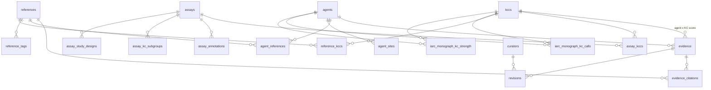

# hKCC database (`hkcc.db`) — table reference

Schema is defined in `db/models.py`. The application reads data through `app/data_client.py` (HTTP API or direct SQLAlchemy). The API exposes subsets via `api/routers/*` and `api/schemas.py`.

| Field | Value |
|-------|-------|
| **Version** | see [`pyproject.toml`](../pyproject.toml) |
| **Developed by** | Data Analysis Team @KaziLab.se |
| **Contact** | hkcc@kazilab.se |

---

## Entity relationship (overview)

**Hub tables:** `kccs`, `agents`, `references`, `assays`  
**Junction / detail tables:** everything else links these four.

---

## 1. Framework

### `kccs` (~14 rows)

**Purpose:** The 14 Key Characteristics of carcinogens (10 core + 4 extended). Defines column headers for the evidence matrix and KC browsing UI.

**Key columns:** `id` (e.g. `kcc-01`), `n`, `title`, `short`, `description`, `mechanism`, `icon`, `is_extended`.

**Relationships:** Referenced by `evidence`, `assay_kccs`, `assay_annotations`, `reference_kccs`, IARC monograph tables.

**Loaded by:** `db/seed/load_seed.py` ← `db/seed/kccs.json` (not from KCAD CSVs).

**Code usage:**

- API: `GET /api/v1/kccs`, `GET /api/v1/kccs/{id}` (`api/routers/kccs.py`)
- App: Overview, Browse KCCs, KCC Detail, Evidence Matrix (`list_kccs()` in `app/data_client.py`)
- Export: `pipelines/export_release.py`

---

## 2. Carcinogenic agents

### `agents` (~93 rows)

**Purpose:** Curated carcinogen profiles (name, CAS, IARC group, summary, monograph metadata).

**Key columns:** `id`, `name`, `cas`, `iarc_group`, `agent_type`, `summary`, `monograph_volume`, `evaluation_year`, `source_ref_id` → `references.id` (provenance anchor, usually KCAD paper).

**Relationships:** Parent of `evidence`, `agent_sites`, `agent_references`; FK target for `assay_annotations.agent_id`, IARC tables.

**Loaded by:**

- `db/seed/kcad/agents.json` + `pipelines/import_kcad.py` (`seed_kcad_agents`)
- `db/seed/kcad/iarc_agents.json` + `pipelines/import_kcad_supplementary.py` (STable1 metadata merge)
- Other seeds / manual rows

**Code usage:**

- API: `GET /api/v1/agents`, `GET /api/v1/agents/{id}` (`api/routers/agents.py`)
- App: Carcinogens list, Agent Detail, Overview (`list_agents`, `get_agent`)
- Monograph API joins `agents` for names

### `agent_sites` (often empty)

**Purpose:** Cancer sites associated with an agent (e.g. lung, liver).

**Key columns:** `(agent_id, site)` composite PK.

**Loaded by:** `agents.json` seed during KCAD import.

**Code usage:** Included in agent API/UI when populated (`Agent.sites` in `api/routers/agents.py`).

---

## 3. Curated evidence matrix (hKCC editorial layer)

### `evidence` (~502 rows)

**Purpose:** Curator-assigned **0–4 evidence scores** for each `(agent_id, kcc_id)` pair. Powers the main evidence heat-map.

**Key columns:** `agent_id`, `kcc_id`, `score` (0–4), `n_refs`, `curator_notes`, `last_updated`. Unique on `(agent_id, kcc_id)`.

**Relationships:** FK → `agents`, `kccs`; child `evidence_citations`, `revisions`.

**Loaded by:** `pipelines/import_10yr_kcc.py` (aggregates IARC 10-year calls into scores; does **not** overwrite manual curator scores). KCAD import explicitly does **not** write this table.

**Code usage:**

- API: `GET /api/v1/matrix` builds scores from `evidence` (`api/routers/matrix.py`)
- API: agent detail embeds evidence cells (`api/routers/agents.py`)
- App: Evidence Matrix, Overview fingerprint, KCC Detail (`get_matrix`, `agents_with_evidence`)
- Contribute: `POST /api/v1/contribute` targets existing `evidence` rows (`api/routers/contribute.py`)

### `evidence_citations` (~502 rows)

**Purpose:** Links each evidence cell to supporting `references` rows.

**Key columns:** `(evidence_id, reference_id)` composite PK.

**Loaded by:** `import_10yr_kcc.py`; `import_kcad.link_evidence_citations()` adds KCAD refs to existing evidence without changing scores.

**Code usage:**

- Agent detail returns `reference_ids` per evidence cell (`api/routers/agents.py`)
- App: `evidence_for_agent()` resolves citation cards (`app/data_client.py`)

### `revisions` (often empty)

**Purpose:** Pending community proposals to change an evidence score (v2 curation workflow).

**Key columns:** `evidence_id`, `proposed_score`, `rationale`, `status`, optional `curator_id`.

**Loaded by:** `POST /api/v1/contribute` only (`api/routers/contribute.py`).

**Code usage:** API contribute endpoint; not yet surfaced in Streamlit curation UI.

### `curators` (often empty)

**Purpose:** Curator accounts for signed revisions.

**Loaded by:** Manual / future auth; linked from `revisions.curator_id`.

---

## 4. Literature

### `references` (~1,091 rows)

**Purpose:** Bibliographic records (KCAD studies, foundational papers, KCAD source paper, Rusyn 2024).

**Key columns:** `id`, `authors`, `title`, `journal`, `year`, `doi`, `pmid`, `source` (`kcad`, `foundational`, `kcad-paper`, etc.), `url`, `pdf_path`.

**Relationships:** Hub for tags, agent links, evidence citations, annotation FKs, `source_ref_id` on many tables.

**Loaded by:**

- `import_kcad.py` ← `filtered_table.csv` (deduped by DOI/PMID/Citation)
- `import_kcad.py` / supplementary: `kcad-paper-rigutto-2025`
- `import_10yr_kcc.py` + `db/seed/refs/foundational.json`

**Code usage:**

- API: `GET /api/v1/assays/references`, `GET /api/v1/agents/{id}/references`, `GET /api/v1/methodology/source`
- App: Literature page, reference cards on agent/KCC pages (`list_references`, `references_for_agent`)
- Citations: `api/citations.py` (BibTeX/RIS; not all wired to routes)

### `reference_tags` (~1,103 rows)

**Purpose:** Facet tags on references (`kcad`, `Foundational`, `Methodology`, etc.).

**Key columns:** `(reference_id, tag)` composite PK.

**Loaded by:** KCAD import (`tag=kcad`); foundational seed for other refs.

**Code usage:** App filters foundational/methodology refs (`list_references`, `list_foundational_references` in `app/data_client.py`).

### `reference_kccs` (often empty)

**Purpose:** Optional many-to-many: which KCs a reference supports (beyond annotation-level links).

**Loaded by:** Reserved for future curation; KCAD uses `assay_annotations` + tags instead.

---

## 5. KCAD assays and study-level data

### `assays` (~565 rows)

**Purpose:** Assay / method catalog (KCAD methods from pivot table + 16 from STable4/5).

**Key columns:** `id`, `name`, `type`, `target`, `throughput`, `source` (`kcad`, `kcad-stable45`), `granularity`, `source_ref_id`, `name_alt`.

**Relationships:** Parent of `assay_kccs`, `assay_annotations`, subgroups, study designs.

**Loaded by:** `import_kcad.py` ← `pivot_table.csv`; `import_kcad_supplementary.py` ← STable4/5.

**Code usage:**

- API: `GET /api/v1/assays`, filters by `source`, `design`, `subgroup` (`api/routers/assays.py`)
- App: Assays page (`list_assays`, `annotations_for_assay`)

### `assay_kccs` (~693 rows)

**Purpose:** Which KCs (KC1–KC10) each assay is mapped to (pivot “+” marks + supplementary enrichment).

**Key columns:** `(assay_id, kcc_id)` composite PK.

**Loaded by:** `import_kcad.py` (pivot); supplementary may add links for category assays.

**Code usage:** API assay payloads include `kcc_ids`; app `assays_for_kcc()`.

### `assay_annotations` (~20,450 rows)

**Purpose:** **One row per KCAD study** from `filtered_table.csv` — tissue, design, organism, endpoints, monograph chemical, literature link.

**Key columns:** `assay_id`, `kcc_id`, `secondary_kcc_id`, `reference_id`, `agent_id`, `monograph_chem`, `design`, `kc_subgroup`, … (30+ study fields), `source`, `source_ref_id`.

**Relationships:** FK → `assays`, `kccs`, `references`, optional `agents`.

**Loaded by:** `import_kcad.py` ← `filtered_table.csv` (1:1 row count).

**Code usage:**

- API: `GET /api/v1/assays/{id}/annotations`
- App: assay drill-down (`annotations_for_assay`)
- Indirect: KCAD literature linkage; `link_evidence_citations()` reads `(agent_id, kcc_id, reference_id)` triples

### `assay_kc_subgroups` (~667 rows)

**Purpose:** Official KC **subgroup label** per (assay, KC) from STable4/5 (e.g. “DNA adducts”).

**Key columns:** `(assay_id, kcc_id)`, `subgroup`, `source_ref_id`.

**Loaded by:** `import_kcad_supplementary.py` ← `KCManuscript_STables4A-J.xlsx`, `STables5A-J.xlsx`.

**Code usage:** API `AssayOut.subgroups`; assay list filter `?subgroup=`.

### `assay_study_designs` (~942 rows)

**Purpose:** Study designs per (assay, KC): `in_vivo`, `ex_vivo`, `in_vitro`, `in_silico`.

**Key columns:** `(assay_id, kcc_id, design)`, `source` (`stable4` / `stable5`).

**Loaded by:** `import_kcad_supplementary.py` (STable4/5).

**Code usage:** API `AssayOut.study_designs`; filter `?design=in_vitro`.

### `agent_references` (~671 rows)

**Purpose:** Direct **agent ↔ literature** links from KCAD `Monograph_chem` mapping (independent of evidence scores).

**Key columns:** `(agent_id, reference_id)`, `source` (usually `kcad`).

**Loaded by:** `import_kcad.py` from annotations + `db/seed/kcad/monograph_chem_map.json` (only when `agent_id` exists in `agents`).

**Code usage:**

- API: `GET /api/v1/agents/{id}/references`
- App: Agent Detail literature (`references_for_agent`)

**Known data gap:** 164 expected `(agent_id, reference_id)` pairs for `benzene` and `glyphosate` are missing because `monograph_chem_map.json` uses agent ids that do not match `agents.id` (`benzene-iarc`, `glyphosate-iarc`).

---

## 6. KCAD methodology metadata

### `kcad_abbreviations` (49 rows)

**Purpose:** Glossary from KCAD supplementary Table 3.

**Key columns:** `abbreviation`, `expansion`, `source_ref_id`.

**Loaded by:** Seed `db/seed/kcad/abbreviations.json` ← STable3; loaded by supplementary import.

**Code usage:**

- API: `GET /api/v1/methodology/abbreviations`
- App: Methodology page (`list_abbreviations`)

### `kcad_column_definitions` (28 rows)

**Purpose:** Data dictionary for `filtered_table.csv` columns (STable 2).

**Key columns:** `column_name`, `definition`, `source_ref_id`.

**Loaded by:** `db/seed/kcad/column_definitions.json` ← STable2.

**Code usage:**

- API: `GET /api/v1/methodology/columns`
- App: Methodology page (`list_column_definitions`)

---

## 7. IARC 10-year retrospective (Rusyn et al. 2024)

### `iarc_monograph_kc_calls` (~1,437 rows)

**Purpose:** Per (agent, KC, monograph volume, model system) qualitative calls: Yes / No / Equivocal / Protective.

**Key columns:** `agent_id`, `kcc_id`, `monograph_volume`, `model_system`, `call`, `raw_call`, `source_ref_id` → `rusyn2024-tenyears`.

**Loaded by:** `pipelines/import_10yr_kcc.py` ← `toxsci-23-0374-File012.xlsx` (under `references/kcc-10yr/` at build time; not in `ref_db/`).

**Code usage:**

- API: `GET /api/v1/monograph/calls`, `/volumes`, `/agent/{id}`, `/kcc/{id}` (`api/routers/monograph.py`)
- App: IARC Matrix page (`get_monograph_agent_matrix`, `list_monograph_volumes`)

### `iarc_monograph_kc_strength` (~250 rows)

**Purpose:** Standardized strength per (agent, KC): Strong / Moderate / Weak + IARC `data_role`.

**Key columns:** `(agent_id, kcc_id)`, `strength_label`, `data_role`, `iarc_group`.

**Loaded by:** `import_10yr_kcc.py` ← File014.xlsx.

**Code usage:** API `GET /api/v1/monograph/strengths`; folded into `/monograph/agent/{id}` heat-map JSON.

---

## 8. Release metadata

### `dataset_releases` (1 row)

**Purpose:** Version tags for exports and provenance (`0.0.5`, etc.).

**Key columns:** `tag`, `created_at`, `zenodo_doi`, `notes`.

**Loaded by:** KCAD / 10yr import scripts on successful run.

**Code usage:** `pipelines/export_release.py`; API `/health` returns release tag from config.

---

## How layers fit together in the codebase

| Layer | Tables | Primary UI / API |
|--------|--------|------------------|
| **Framework** | `kccs` | Browse KCCs, matrix columns |
| **Curated scores** | `evidence`, `evidence_citations` | Evidence Matrix, agent fingerprints |
| **KCAD bulk data** | `assays`, `assay_annotations`, `assay_kccs`, subgroups, designs | Assays, methodology |
| **Literature** | `references`, `reference_tags`, `agent_references` | Literature, agent refs |
| **IARC retrospective** | `iarc_monograph_kc_*` | IARC Matrix page, monograph API |
| **Community** | `revisions`, `curators` | `POST /contribute` |
| **Exports** | Most tables above | `pipelines/export_release.py`, API Downloads page |

**Data access path:** `streamlit_app.py` → `app/data_client.py` → either `httpx` to FastAPI (`api/main.py` + routers) or direct `db.session.SessionLocal` queries mirroring the same SQL patterns.

**Build path:** `python -m db.bootstrap_sqlite` → `load_seed` (kccs) → `import_kcad.run` (CSVs + supplementary XLSX) → `import_10yr_kcc.run` (Rusyn XLSX + foundational refs).

---

## Data source mapping (`ref_db/` and other inputs)

| Source | Typical path | Tables affected |
|--------|--------------|-----------------|
| `filtered_table.csv` | `ref_db/` or `suppl_data/` | `assay_annotations`, `references` (kcad), `agent_references` |
| `pivot_table.csv` | `ref_db/` or `suppl_data/` | `assays`, `assay_kccs` |
| `KCManuscript_STable1–5.xlsx` | `ref_db/` or `suppl_data/` | `agents` (metadata), `kcad_*`, `assay_kc_subgroups`, `assay_study_designs` |
| `db/seed/kccs.json` | repo seed | `kccs` |
| `db/seed/refs/foundational.json` | repo seed | `references`, `reference_tags` |
| `db/seed/kcad/*.json` | repo seed | chem map, agents, abbreviations, column defs |
| Rusyn 2024 XLSX (File012/014) | `references/kcc-10yr/` | `iarc_monograph_*`, `evidence`, `evidence_citations` |

Importers default to `suppl_data/` (sibling of `hKCC/`). A local `ref_db/` copy of the KCAD package is equivalent content but must be passed explicitly (e.g. `import_kcad.run(suppl_dir=Path("ref_db"))`) unless files are symlinked or copied to `suppl_data/`.

---

## Provenance anchors (`references.id`)

Many rows carry `source_ref_id` pointing to `references.id`:

| Reference id | Role |
|--------------|------|
| `kcad-paper-rigutto-2025` | KCAD paper (Rigutto et al. 2025) — assays, annotations, agents |
| `rusyn2024-tenyears` | IARC 10-year retrospective — monograph calls/strengths, evidence derivation |
| Foundational ids (`smith2016-kcc`, etc.) | Framework / methodology PDFs |

This keeps manuscript-level traceability from UI/API rows back to source publications.

---

## Related documentation

- Schema implementation: `db/models.py`
- API surface: `README.md` (API v1 section)
- KCAD column meanings: `docs/KCAD_DATA_DICTIONARY.md`
- Evidence scoring rules: `docs/KCC_EVIDENCE_RULES.md`
- Project scope: `docs/SCOPE.md`
